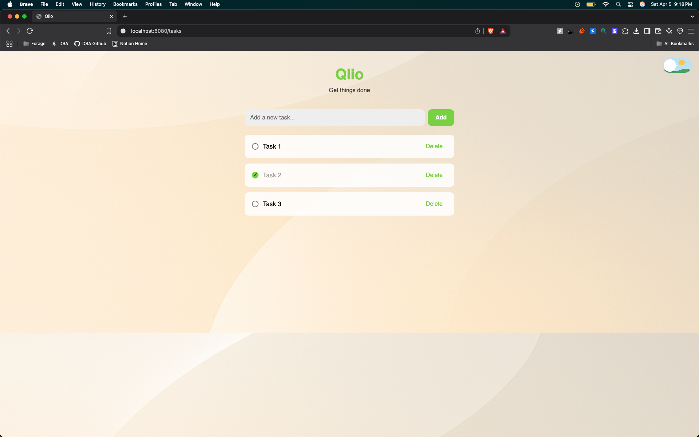
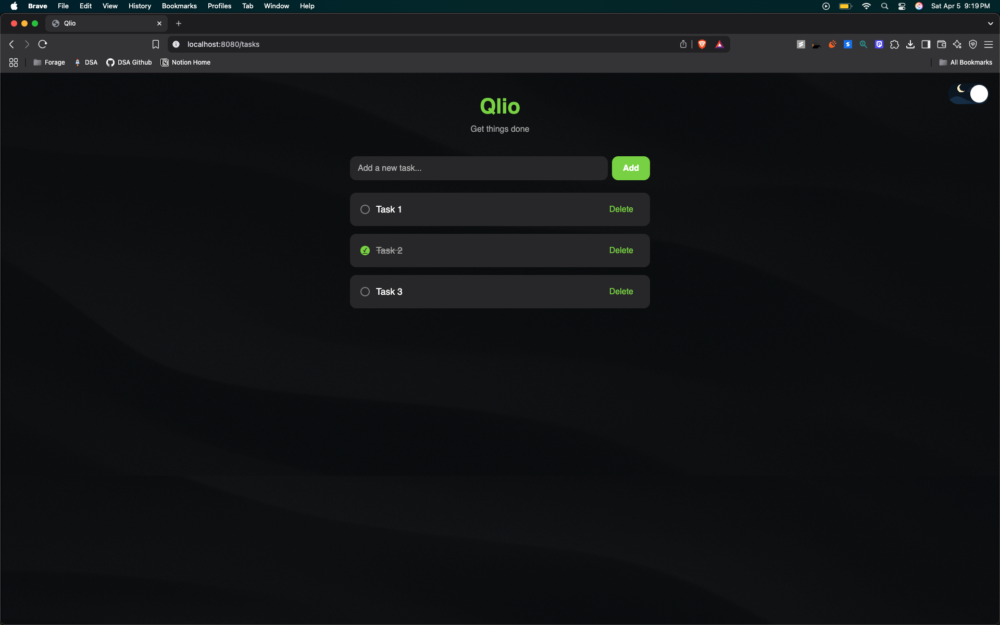

# Qlio

Qlio is a minimalist productivity web app built with Spring Boot and Thymeleaf. It helps you manage your daily tasks with an intuitive, responsive interface and a clean light/dark mode toggle.

---

## Features

- Add, toggle, and delete tasks
- Persist tasks with Spring Data JPA (H2/MySQL compatible)
- Beautiful light/dark theme toggle with animated illustrations
- Fully responsive UI
- Custom illustrations and branding

---

## Screenshots

> Below are the final screenshots of Qlio running in both light and dark modes:

### 🌤️ Light Mode


### 🌙 Dark Mode


Make sure to update the `screenshots/` directory with these images in your repo.

---

## Tech Stack

**Backend**
- Java 17
- Spring Boot 3.x
- Spring MVC
- Spring Data JPA
- H2 (dev) / MySQL (prod)

**Frontend**
- Thymeleaf
- Bootstrap 5
- Custom CSS

**Tools**
- IntelliJ IDEA
- Maven
- Git & GitHub

---

## Running Locally

```bash
# Clone the repo
https://github.com/mduduha/qlio.git
cd qlio

# Run the app (Spring Boot)
./mvnw spring-boot:run
```

The app will be available at `http://localhost:8080/tasks`

---

## Folder Structure

```
qlio
├── src
│   └── main
│       ├── java/com/app/qlio
│       │   ├── controller
│       │   ├── model
│       │   ├── repository
│       │   └── service
│       ├── resources
│       │   ├── static  ← CSS/Images
│       │   └── templates ← HTML (Thymeleaf)
│       └── QlioApplication.java
└── pom.xml
```

---

## Contribution

This is a personal project, but feel free to open issues or suggest ideas via pull requests. Clean code and design-focused contributions are welcome.

---

## License

This project is licensed under the MIT License.

